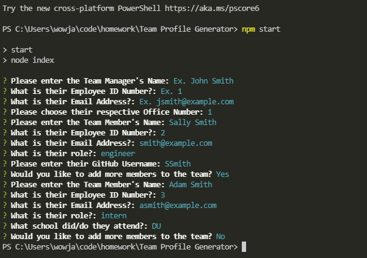
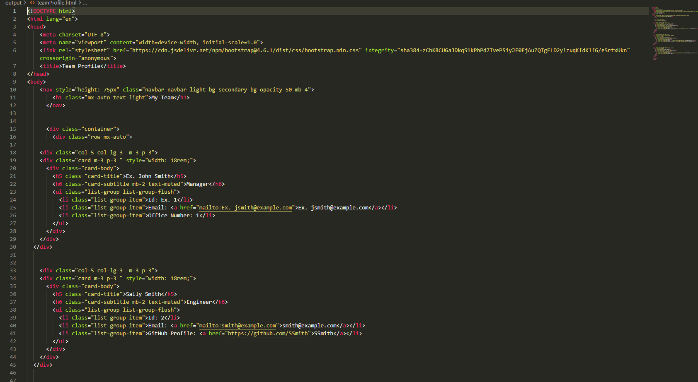

# Team Profile Generator
  
  

  ## Description

This application operates via terminal and will output an HTML page with CSS Styling. On the HTML page will be cards with "profiles" of each team member input by the user. Including Name, Job Title, Email, Id and based on their role of Manager, Engineer or Intern they will have Office Number, GitHub Username or School displayed respectively. 

  ## Table of Contents
  * [Install](#install)
  * [Usage](#usage)
  * [License](#license)
  * [Contributing](#contributing)
  * [Testing](#testing)
  * [Questions](#questions)

## Install

To install all necessary dependencies, use the following command:

~~~
npm i
~~~

## Usage

To use the appplication, use the following command: 

~~~
npm start
~~~

## License

This project is under the Open license!

## Contributing
To contribute please contact me at the email below.

## Testing

To test the application, use the following command:

~~~
npm test
~~~

## Questions

For any questions regarding the repo or application, please contact me at jacobllewis@outlook.com. I do have additional projects on display at https://github.com/JLewis1995/.

Link to GitHub Repo: https://github.com/JLewis1995/Team-Profile-Generator

Screenshots:

